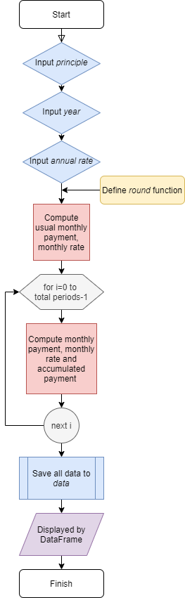

# 作業一：本金平均攤還試算
## 學習歷程
 
一、做作業前把老師的[投影片](https://docs.google.com/presentation/d/e/2PACX-1vQanrLs-ZSFlnAXkUL5uLO9PVvrK1GaNFcjCVwC7IyIt16w_NuaCYUaO6lRxF54Qub_RntV2FGKr-Dm/pub?start=false&loop=false&delayms=3000&slide=id.p)好好看過一次，主要了解時間變化是如何影響到現金流的價值，其中的數學式皆自己推導過。

二、接下來上網查詢並確認本次作業的本金平均攤還是怎麼樣的流程：[「本金均攤」與「本息均攤」差別 - 聰明貸款](https://www.smartloan.com.tw/viewBlogDetail.do?kmId=45)，由此知道這種方法的核心是以下兩點：  
 * 借款總額 / 總期數 = 每期應繳本金 &emsp; (每期應繳本金相同)
 * 每期貸款餘額 * (年利率/12) = 當月利息 &emsp; (每月利息會變動)  
 
 因此 當月月付金 = 每期應繳本金 + 當月利息； 當月本金利息累計 = 當月(包括)以前的月付金之總和。

三、處理細節： 
 * 由於總本金除以總期數不一定能整除，若每期應繳本金使用無條件進入法，則最末月需繳的本金一般來說會比較少。
 * 利息的部分採用一般來說最合理的**四捨五入法**來計算，但由於我所使用的Python裡的`round`函數在四捨五入取整數時有不明的問題，因此這部分是我是自己另外定義一個函數(`rnd`)來處理。

四、最後為了檢查輸出正確與否，參考老師給的網站：[臺南三信 本金平均攤還試算](https://ttc.scu.org.tw/memdca1.htm) 來做比較。 

## 程式流程圖

